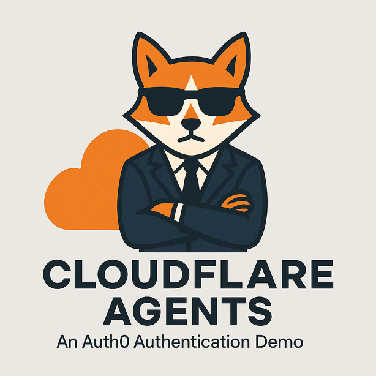

# 🤖 Chat Agent Starter Kit with Auth0 Authentication



A starter template for building AI-powered chat agents using Cloudflare's Agent platform, powered by [`agents`](https://www.npmjs.com/package/agents) and secured with Auth0 authentication. This project provides a foundation for creating interactive chat experiences with AI, complete with a modern UI, tool integration capabilities, and user authentication.

## Features

- 💬 Interactive chat interface with AI
- 🔐 Auth0 authentication and authorization
- 📜 Securely get access tokens for Federated Connections using [Auth0 Token Vault](https://auth0.com/docs/secure/tokens/token-vault/configure-token-vault)
- 🙆‍♂️ Backchannel Authentication for **human-in-the-loop** interactions using [Auth0 CIBA](https://auth0.com/docs/get-started/authentication-and-authorization-flow/client-initiated-backchannel-authentication-flow/user-authentication-with-ciba)
- 👤 User-specific chat history and management
- 🛠️ Built-in tool system with human-in-the-loop confirmation
- 📅 Advanced task scheduling (one-time, delayed, and recurring via cron)
- 🌓 Dark/Light theme support
- ⚡️ Real-time streaming responses
- 🔄 State management and chat history
- 🎨 Modern, responsive UI

## Prerequisites

- Cloudflare account with Workers & Workers AI enabled
- OpenAI API key
- Auth0 account with a configured:
  - Web Application
  - API (resource server)

## Auth0 Configuration

### Step 1: Create an Auth0 API

1. Log in to your Auth0 dashboard
2. Navigate to "Applications > APIs" and click "Create API"
3. Provide a name and identifier (audience)
4. Note the API Identifier (audience) for later use

### Step 2: Create an Auth0 Application

Note: you can also use the default app.

1. In your Auth0 dashboard, go to "Applications -> Applications" and click "Create Application"
2. Select **Regular Web Applications** as the application type and click **Create**
3. Configure the following settings:
   - Allowed Callback URLs: `http://localhost:3000/auth/callback` (development) and your production URL
   - Allowed Logout URLs: `http://localhost:3000` (development) and your production URL
4. Note your Domain, Client ID, and Client Secret for later use
5. Scroll down to the **Refresh Token Rotation** section and disable the Allow Refresh Token Rotation option.
6. Scroll down and expand the **Advanced** section. Switch to the **Grant Types** tab and enable the **Token Vault** grant type.
7. Click **Save** in the bottom right to save your changes.

### Step 3: Configure My Account API

The Connected Accounts flow uses the [My Account API](https://auth0.com/docs/manage-users/my-account-api) to create and manage connected accounts for a user across supported external providers.

In the Auth0 Dashboard, configure the My Account API:

- Navigate to **Applications > APIs**, locate the My Account API banner, and select Activate to activate the Auth0 My Account API.
- Once activated, select **Auth0 My Account API** and then select the **Application Access** tab.
  - Find your client application and select **Edit** to configure its **application access policies**.
  - Select **User Access** and under **Authorization**, select **Authorized**.
  - For the permissions, select **All** the **Connected Accounts scopes** for the application.
  - Select **Save**. This creates a client grant that allows your client application to access the My Account API with the Connected Accounts scopes on the user’s behalf.
- Next, navigate to the **Settings** tab. Under **Access Settings**, select **Allow Skipping User Consent**.

### Step 4: Define a Multi-Resource Refresh Token policy for your Application

After your web application has been granted access to the My Account API, you will also need to leverage the [Multi-Resource Refresh Token](https://auth0.com/docs/secure/tokens/refresh-tokens/multi-resource-refresh-token) feature, which enables the refresh token delivered to your application to also obtain an access token to call the My Account API.

You can quickly define a **refresh token policy** for your application to use when requesting access tokens for the My Account API by doing the following:

- Navigate to **Applications > Applications** and select your client application.
- On the **Settings** tab, scroll down to the **Multi-Resource Refresh Token** section.
- Select **Edit Configuration** and then enable the MRRT toggle for the **Auth0 My Account API**.

### Step 5: Configure Social Integrations

Configure a social connection for use with the application. Reference the setup guides for configuring [Google](https://auth0.com/ai/docs/integrations/google), [Github](https://auth0.com/ai/docs/integrations/github), and [Slack](https://auth0.com/ai/docs/integrations/slack) social integrations.

## Quick Start

1. Create a new Cloudflare Workers project using the Auth0 starter template:

```bash
npx create-cloudflare@latest --template auth0-lab/cloudflare-agents-starter
```

3. Set up your environment:

Create a `.dev.vars` file based on the example:

```env
# OpenAI API key
OPENAI_API_KEY=sk-your-openai-api-key

# Auth0 Configuration
# trailing slash in ISSUER is important:
AUTH0_DOMAIN="your-tenant.us.auth0.com/"
AUTH0_CLIENT_ID="your-auth0-client-id"
AUTH0_CLIENT_SECRET="your-auth0-client-secret"
AUTH0_SESSION_ENCRYPTION_KEY="generate-a-random-key-at-least-32-characters-long"
AUTH0_AUDIENCE="https://your-auth0-api-identifier"

# Application base URL
BASE_URL=http://localhost:3000
```

4. Run locally:

```bash
npm start
```

5. Deploy:

```bash
npm run deploy
```

## Project Structure

```
├── src/
│   ├── server.ts                # Main worker with auth configuration
│   ├── chats.ts                 # Chat management functions using Cloudflare KV
│   ├── agent/                   # Agent-related code
│   │   ├── index.ts             # Chat agent implementation with Auth0 integration
│   │   ├── tools.ts             # Tool definitions and implementations
│   │   ├── utils.ts             # Agent utility functions
│   │   ├── auth0-ai.ts          # Auth0 AI initialization and configuration
│   │   └── shared.ts            # Shared constants and types
│   ├── client/                  # Frontend client application
│   │   ├── app.tsx              # Chat UI implementation
│   │   ├── home.tsx             # Home page component
│   │   ├── index.tsx            # Entry point for React app
│   │   ├── Layout.tsx           # Layout component
│   │   └── styles.css           # UI styling
│   ├── components/              # UI components
│   │   ├── auth0/               # Auth0-specific components
│   │   ├── auth0-ai/            # Auth0-specific components
│   │   ├── chatList/            # Chat list components
│   │   └── ...                  # Other UI components
│   └── hooks/                   # React hooks
│       ├── useUser.tsx          # User authentication hook
│       └── ...                  # Other custom hooks
```

## Authentication Flow

This starter kit uses Auth0 for authentication and authorization:

1. Users log in using Auth0 credentials
2. Auth0 provides JWT tokens for API authentication
3. The Agent uses the `AuthAgent` mixin from the `@auth0/auth0-cloudflare-agents-api` package to validate the JWT token
4. API requests and WebSocket connections are secured with the JWT token
5. Each chat is associated with its owner (user ID) to ensure data isolation

### Authentication Packages

This project utilizes two key npm packages for authentication:

- [`@auth0/auth0-hono`](https://github.com/auth0-lab/auth0-hono) - Handles browser-based authentication flows, session management, and token handling for the web interface.
- [`@auth0/auth0-cloudflare-agents-api`](https://github.com/auth0-lab/auth0-cloudflare-agents-api/) - Secures WebSocket connections and API endpoints for the agent, providing token validation and authorization for all agent interactions.
- [`@auth0/ai`](https://github.com/auth0-lab/auth0-ai-js/) - Provides AI capabilities for the agent. Token Vault for Federated Connections, Backchannel Authorization, and more.

These packages work together to provide a comprehensive authentication solution that secures both the web interface and the underlying agent communication.

## Auth0 AI Powerful Integrations

The example contains two powerful integrations with Auth0 AI:

- **Token Vault**: Securely store and retrieve access tokens for Federated Connections, allowing the agent to access third-party APIs on behalf of the user.
- **Backchannel Authentication**: Implement human-in-the-loop interactions using Client-Initiated Backchannel Authentication (CIBA) flow, allowing the agent to request user confirmation for actions that require human input.

Prompts:

- `Am I available next monday 9am?` - This messsage will call the [check-user-calendar](src/agent/auth0-ai-sample-tools/check-user-calendar.ts) which is wrapped by the `@auth0/ai` Authorizer. If the application can't access the user's calendar it will fire a popup window with the Authorization process. Once completed, the agent will be able to access the user's calendar and answer the question.
- `Buy 100 shares of MSFT` - This message will call the [buy-stock](src/agent/auth0-ai-sample-tools/buy-stock.ts) tool which is wrapped by the `@auth0/ai` Backchannel Authorizer. The agent fires an authorization request to the user, who will receive a push notification on their device. The user can then approve or deny the request. If approved, the agent will execute the tool and "buy the stock".

Another interesting scenario is triggering the buy stock tool on a schedule. For example, you can ask the agent to "buy 100 shares in 5 minutes". The agent will schedule the tool execution using the Cloudflare agent Task Scheduler, which supports one-time, delayed, and recurring tasks via cron expressions. Once it executes the task, it will again fire the authorization request to the user, who can approve or deny the request.

## Customization Guide

### Adding New Tools

Add new tools in `src/agent/tools.ts` using the tool builder:

```typescript
// Example of a tool that requires confirmation
const searchDatabase = tool({
  description: "Search the database for user records",
  inputSchema: z.object({
    query: z.string(),
    limit: z.number().optional(),
  }),
  // No execute function = requires confirmation
});

// Example of an auto-executing tool
const getCurrentTime = tool({
  description: "Get current server time",
  inputSchema: z.object({}),
  execute: async () => new Date().toISOString(),
});
```

To handle tool confirmations, add execution functions to the `executions` object:

```typescript
export const executions = {
  searchDatabase: async ({
    query,
    limit,
  }: {
    query: string;
    limit?: number;
  }) => {
    // Implementation for when the tool is confirmed
    const results = await db.search(query, limit);
    return results;
  },
  // Add more execution handlers for other tools that require confirmation
};
```

### Extending Auth0 Integration

The integration uses Hono's OpenID Connect middleware for authentication and session management. You can customize the authentication behavior in `src/server.ts`.

The agent uses the `AuthAgent` mixin from `@auth0/auth0-cloudflare-agents-api` package to secure API endpoints and WebSocket connections. Each chat is associated with its owner through the `setOwner` method to ensure users can only access their own chats.

## Learn More

- [`@auth0/auth0-hono`](https://github.com/auth0-lab/auth0-hono)
- [`@auth0/auth0-cloudflare-agents-api`](https://github.com/auth0-lab/auth0-cloudflare-agents-api/)
- [`@auth0/ai`](https://github.com/auth0-lab/auth0-ai-js/)
- [`agents`](https://github.com/cloudflare/agents/blob/main/packages/agents/README.md)
- [Cloudflare Agents Documentation](https://developers.cloudflare.com/agents/)
- [Cloudflare Workers Documentation](https://developers.cloudflare.com/workers/)
- [Auth0 Documentation](https://auth0.com/docs/)

## Feedback

### Contributing

We appreciate feedback and contribution to this repo! Before you get started, please see the following:

- [Auth0's general contribution guidelines](https://github.com/auth0/open-source-template/blob/master/GENERAL-CONTRIBUTING.md)
- [Auth0's code of conduct guidelines](https://github.com/auth0/open-source-template/blob/master/CODE-OF-CONDUCT.md)

### Raise an issue

To provide feedback or report a bug, please [raise an issue on our issue tracker](https://github.com/auth0-lab/cloudflare-agents-starter/issues).

### Vulnerability Reporting

Please do not report security vulnerabilities on the public GitHub issue tracker. The [Responsible Disclosure Program](https://auth0.com/responsible-disclosure-policy) details the procedure for disclosing security issues.

---

<p align="center">
  <picture>
    <source media="(prefers-color-scheme: light)" srcset="https://cdn.auth0.com/website/sdks/logos/auth0_light_mode.png"   width="150">
    <source media="(prefers-color-scheme: dark)" srcset="https://cdn.auth0.com/website/sdks/logos/auth0_dark_mode.png" width="150">
    
  </picture>
</p>
<p align="center">Auth0 is an easy to implement, adaptable authentication and authorization platform. To learn more checkout <a href="https://auth0.com/why-auth0">Why Auth0?</a></p>
<p align="center">
This project is licensed under the Apache 2.0 license. See the <a href="/LICENSE"> LICENSE</a> file for more info.</p>
